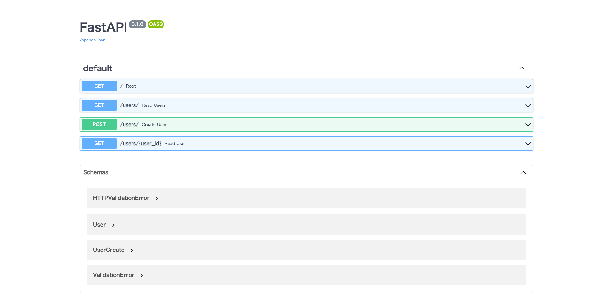

# fastapi-sample

FastAPI sample app


## Requirements

- Docker

## Environment Variables

MySQL credentials are given by environment variables:

- `MYSQL_HOST`
- `MYSQL_DATABASE`
- `MYSQL_USER`
- `MYSQL_PASSWORD`
## Getting Started

1. Start MySQL and Fast API.
    ```
    docker compose up
    ```

1. Create a user.

    ```
    curl -X 'POST' \
    'http://localhost:8000/users/' \
    -H 'accept: application/json' \
    -H 'Content-Type: application/json' \
    -d '{
    "email": "string",
    "password": "string"
    }'
    ```

1. Get users.

    ```
    curl -X 'GET' \
    'http://localhost:8000/users/?skip=0&limit=100' \
    -H 'accept: application/json'
    ```

1. For more details: http://localhost:8000/docs

    

# References
- https://fastapi.tiangolo.com/tutorial/sql-databases
