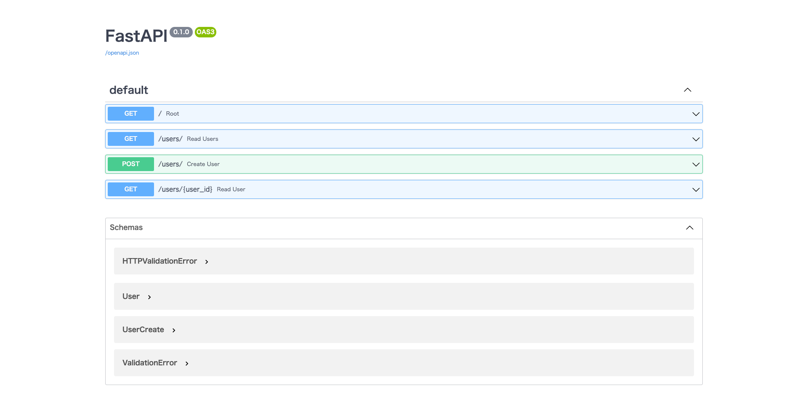

# fastapi-sample

FastAPI sample app


## Requirements

- Docker

## Versions

| Component | Version |
|---|---|
| Python | 3.14 |
| uv | 0.12.19 |
| FastAPI | 0.141.1 |
| Pydantic | 2.13.5 |
| SQLAlchemy | 2.1.0 |
| Uvicorn | 0.53.0 |
| PyMySQL | 1.2.3 |
| MySQL | 8 |

Dependencies are managed by [uv](https://docs.astral.sh/uv/) (`app/pyproject.toml` and `app/uv.lock`). To add or upgrade a package:

```
cd app
uv add <package>        # add
uv lock --upgrade       # upgrade all
```

## Environment Variables

MySQL credentials are given by environment variables:

- `MYSQL_HOST`
- `MYSQL_DATABASE`
- `MYSQL_USER`
- `MYSQL_PASSWORD`
## Getting Started

1. Start MySQL and Fast API.
    ```
    docker compose up
    ```

1. Create a user.

    ```
    curl -X 'POST' \
    'http://localhost:8000/users/' \
    -H 'accept: application/json' \
    -H 'Content-Type: application/json' \
    -d '{
    "email": "string",
    "password": "string"
    }'
    ```

1. Get users.

    ```
    curl -X 'GET' \
    'http://localhost:8000/users/?skip=0&limit=100' \
    -H 'accept: application/json'
    ```

1. For more details: http://localhost:8000/docs

    

# References
- https://fastapi.tiangolo.com/tutorial/sql-databases
